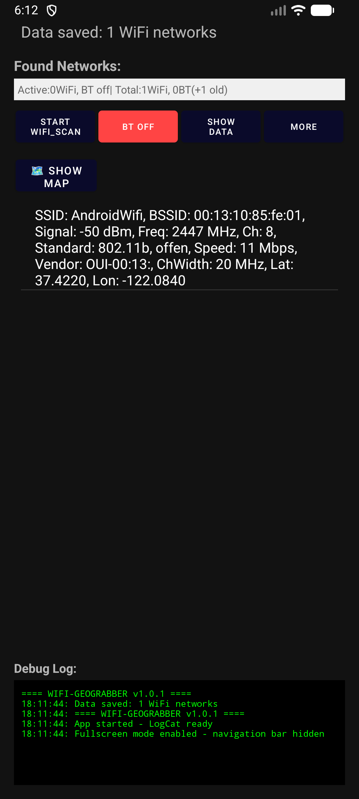
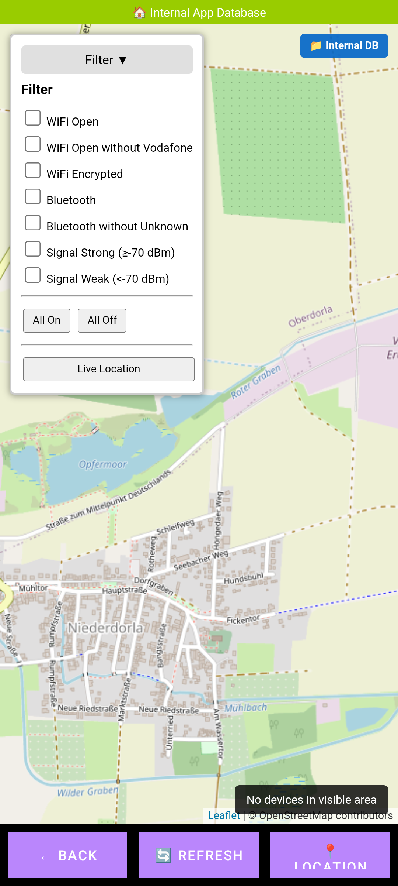

[](https://deepwiki.com/arn-c0de/Android-WIFI-BT_geograbber)

📚 **[Documentation](docs/)** · 🚀 **[Database Combiner Guide](docs/quickstart/database_combiner_quickstart.md)** · 🗺️ **[Map Viewer Guide](docs/quickstart/map_viewer_quickstart.md)** · 📁 **[Project Structure](PROJECT_STRUCTURE.md)** · 📂 **[Detailed Structure](docs/project-structure/PROJECT_STRUCTURE.md)** · � **[Changelog](CHANGELOG.md)** · 🤝 **[Contributing](CONTRIBUTING.md)** · 🔒 **[Security](SECURITY.md)** · 📜 **[Code of Conduct](CODE_OF_CONDUCT.md)**

## [🌐 Project Website](https://arn-c0de.github.io/Geograbber)

<div align="left" style="display:flex;align-items:center;gap:16px;">
   
   <div style="display:flex;flex-direction:column;justify-content:center;">
      <h1 style="margin:0; padding:0; font-size:2em; line-height:1.1;">📡 WiFi & Bluetooth GeoGrabber</h1>
      <span style="font-size:1.1em; color:#555; font-weight:bold;">Professional Geolocation & Signal Mapping</span>
      
<div align="left">
  <b>Scan, Map, and Analyze WiFi Networks & Bluetooth Devices with GPS Precision</b>
</div>

   </div>
</div>

<div align="left">
   <b>Current Version: v1.0.4</b>
</div>

---

   > **Project Status Notice**
   >
   > This is a very early stage of the program. While it is already functional, it is based on an older project that I have recently resumed. Therefore, extensive refactoring and further development are still required. Expect ongoing changes and improvements as work continues.


---

### ⚠️ Python Integration Notice (v1.0.4)
The two Python tools are not yet fully compatible with the new encrypted databases.  
Additional development is required to implement full SQLCipher support and key handling.  

> ➡️ If you need to work **without encryption**, please use **version 1.0.2**.

---

## 🤝 Contribute to GeoGrabber!

> **We welcome your ideas, bug reports, and feature requests!**

<div align="center">
  <a href="CONTRIBUTING.md">
    
  </a>
</div>

---

## 📖 Table of Contents

- [Overview](#-overview)
- [Features](#-features)
- [Screenshots](#-screenshots)
- [Requirements](#-requirements)
- [Installation](#-installation)
- [Usage](#-usage)
- [Python Tools](#-python-tools)
- [Technical Details](#-technical-details)
- [Privacy & Ethics](#-privacy--ethics)
- [Known Limitations](#-known-limitations)
- [Project Structure](#-project-structure)
- [Contributing](#-contributing)
- [License](#-license)
- [Disclaimer](#-disclaimer)

---

## 🎯 Overview

WiFi & Bluetooth GeoGrabber is a powerful geolocation tool for Android, designed as a modern **Wardriving App**. It scans for nearby WiFi networks and Bluetooth devices, records their signal strength and location, and visualizes the collected data on an interactive map. 

**Detected networks and devices are shown live on the map within the app.** All scan results are saved in a local SQLite database (`.db`), which can be exported and loaded both on Android and on your PC for further analysis. 

On Android, you can view, filter, and manage the data directly in the app. For advanced analysis and visualization, simply transfer the `.db` file to your PC and use the included Python tools to merge, plot, and explore your scan data interactively.

GeoGrabber is ideal for network analysis, signal mapping, and understanding wireless device distribution in different areas—whether on your mobile device or desktop.

> **Note:** This app is intended for legal, ethical wardriving, educational purposes, and authorized network analysis only. Please respect privacy laws and only scan networks in areas where you have permission.

## ✨ Features

### 📡 Network Scanning

- 🔍 **WiFi Network Scanning** – Continuous or on-demand WiFi network detection
- 📶 **Bluetooth Device Scanning** – Detect nearby Bluetooth devices (Classic and BLE)
- ⚙️ **Background Scanning** – Service-based scanning that runs in the background
- 📊 **Signal Strength Tracking** – Records RSSI (signal strength) for each device

### 🗺️ Location & Mapping

- 📍 **GPS Integration** – Records precise GPS coordinates for each scan
   - 🌐 **Interactive Map** – Visualize collected data on a Leaflet-based web map
   - 🌓 **Dark Mode Toggle** – Switch between light and dark map styles (OSM/CartoDB)
   - 🖍️ **Persistent Map Style** – User map style choice is saved and restored
   - 🔍 **Location Filtering** – View devices within specific geographic boundaries
   - 🎯 **Live Location** – Center map on your current GPS position (auto-tracking, keeps user zoom)
   - 🛑 **Live Location Auto-Off** – Live location tracking disables when jumping to search result
   - 📍 **Custom Location Marker** – Your position is shown as a red dot
   - 🧹 **Filter Popup UX** – Filter popup can be closed by clicking on the map
   - 🖤 **Improved Search Bar** – Search bar text is now black for better readability

### 💾 Data Management

- 🗄️ **SQLite Database** – Stores all scanned networks and devices locally
- � **Database Encryption** – AES-256 encryption with SQLCipher (optional)
- �💼 **Data Export** – Save database as a file for backup or analysis
- 📥 **Data Import** – Load external databases to view or merge data (supports encrypted databases)
- 📊 **Database Statistics** – View total counts of WiFi networks and Bluetooth devices
- 🗑️ **Clear Database** – Delete all stored data when needed

### 🔐 Security Features

- 🛡️ **AES-256 Encryption** – Database encryption using SQLCipher
- 🔑 **Android Keystore Integration** – Hardware-backed secure passphrase storage
- 🔐 **Passphrase Protection** – User-controlled encryption with customizable passphrase
- 🧬 **Biometric Unlock (NEW)** – Unlock your encrypted database instantly using fingerprint or face authentication. Passphrase is securely stored with Android Keystore and never leaves the device. Biometric unlock uses the same passphrase as manual login for maximum security and reliability.
- 🔄 **Database Migration** – Seamless conversion from unencrypted to encrypted databases
- 💾 **Encrypted Import/Export** – Full support for encrypted database files
- 🎯 **Zero-Knowledge Design** – Passphrases never logged or transmitted
- 📖 **[Encryption Guide](docs/quickstart/database_encryption_quickstart.md)** – Complete setup and usage instructions

### 📋 Network Information Captured

**WiFi Networks:**
| Property | Description |
|----------|-------------|
| SSID | Network Name |
| BSSID | MAC Address |
| Signal Strength | Power level in dBm |
| Frequency | Operating frequency in MHz |
| Channel | WiFi channel number |
| Channel Width | Bandwidth (20/40/80/160 MHz) |
| Security | Encryption type (WPA2, WPA3, etc.) |
| GPS Coordinates | Latitude & Longitude |
| Timestamp | Scan date & time |

**Bluetooth Devices:**
| Property | Description |
|----------|-------------|
| Device Name | Bluetooth device name |
| MAC Address | Hardware address |
| Device Type | Classic or BLE |
| Signal Strength | RSSI value |
| GPS Coordinates | Latitude & Longitude |
| Timestamp | Scan date & time |


## 📸 Screenshots

<div align="center">
  
  
</div>

**Screenshot Description:**

   - *WiFi Scanning Starten*: Start WiFi scanning
   - *BT AUS*: Bluetooth scanning off
   - *Show Data*: View all scanned data
   - *More*: Access advanced features

The screenshot above demonstrates the main scanning interface, live network list, and debug log. The app provides real-time updates and easy access to mapping and data management features.

---

## 📋 Requirements

### System Requirements

| Component | Requirement |
|-----------|-------------|
| **Android Version** | Android 6.0 (API 23) or higher |
| **RAM** | 2 GB minimum (4 GB recommended) |
| **Storage** | 50 MB for app, variable for database |
| **GPS** | Required for location tracking |

### Required Permissions

| Permission | Purpose |
|------------|---------|
| `ACCESS_FINE_LOCATION` | Precise GPS coordinates |
| `ACCESS_COARSE_LOCATION` | Approximate location |
| `ACCESS_WIFI_STATE` | WiFi status monitoring |
| `CHANGE_WIFI_STATE` | WiFi scanning control |
| `BLUETOOTH` | Bluetooth basic access |
| `BLUETOOTH_ADMIN` | Bluetooth device management |
| `BLUETOOTH_SCAN` | Bluetooth scanning (Android 12+) |
| `BLUETOOTH_CONNECT` | Bluetooth connection (Android 12+) |
| `FOREGROUND_SERVICE` | Background scanning |
| `READ_EXTERNAL_STORAGE` | Database import |
| `WRITE_EXTERNAL_STORAGE` | Database export |

---

## 📦 Installation


> **⚠️ Note (October 2025):**
> 
> There are currently issues with automatic dependency installation via the setup scripts (`setup.bat` / `setup.sh`) due to network or PyPI problems. This will be fixed soon. In the meantime, you can manually install the required Python packages in your virtual environment:
>
> **Manual Installation:**
> 1. Activate your virtual environment:
>    - Windows: `venv\Scripts\activate.bat` or `venv\Scripts\Activate.ps1`
>    - Linux: `source venv/bin/activate`
> 2. Download the required wheel files for each package (e.g. from https://pypi.org/project/folium/#files and https://pypi.org/project/branca/#files).
> 3. Install them manually:
>    ```
>    pip install path/to/folium-*.whl
>    pip install path/to/branca-*.whl
>    pip install geopy
>    ```
> 4. If you encounter further dependency errors, download and install those packages in the same way.
>
> The setup scripts will be updated soon for improved reliability.


### Option 1: Build from Source (Recommended)

**Prerequisites:**
- Android Studio (latest version)
- JDK 11 or higher
- Git

**Steps:**

```bash
# 1. Clone the repository
git clone https://github.com/arn-c0de/Geograbber.git
cd Geograbber

# 2. Open in Android Studio
# Open Android Studio -> Open -> Select 'WIFIGEOGRABBER' directory

# 3. Sync Gradle
# Android Studio will automatically sync Gradle dependencies

# 4. Build the project
# Build -> Make Project (Ctrl+F9)

# 5. Run on device
# Run -> Run 'app' (Shift+F10)
```

### Option 2: Install APK

1. Download the latest APK from the [Releases](https://github.com/arn-c0de/Geograbber/releases) page
2. Enable "Install from Unknown Sources" in your Android settings:
   - **Settings → Security → Unknown Sources** (Android 7 and below)
   - **Settings → Apps → Special Access → Install Unknown Apps** (Android 8+)
3. Install the APK on your device

### Post-Installation Setup

1. **Grant Permissions** – The app will request necessary permissions on first launch
2. **Enable Location** – Ensure GPS is enabled for accurate coordinates
3. **Enable Bluetooth** – Required for Bluetooth device scanning

### 🔐 Secret Management

For API key management, environment variables, and security best practices:
- **Quick Setup**: [Secret Management Quick Start](./SECRET_MANAGEMENT_QUICKSTART.md) (5-minute guide)
- **Full Documentation**: [Secret Management Guide](./docs/security/SECRET_MANAGEMENT.md)

**Note**: Currently, the project works 100% offline and requires no API keys. The secret management system is provided for future extensibility.

---

## 💡 Usage

### Basic Scanning

**1. Start WiFi Scanning**
```
Tap "WiFi Start" button → App begins scanning for WiFi networks
```

**2. Enable Bluetooth Scanning**
```
Tap "BT Off" button → Bluetooth scanning activates
```

**3. View Results**
```
Scanned networks appear in the list below the control buttons
Real-time updates with signal strength and details
```

**4. View on Map**
```
Tap "Show Map" → Visualize collected data on interactive map
```

### Map View Features

| Action | Description |
|--------|-------------|
| **Refresh** | Update map with latest scanned data |
| **Location** | Center map on your current GPS position |
| **Zoom** | Pinch to zoom in/out |
| **Pan** | Drag to move around the map |
| **Marker Click** | View detailed information about a device |
| **Back** | Return to the main scanning interface |

### Advanced Features

**More Actions Menu** (Tap "More"):

| Option | Description |
|--------|-------------|
| 💾 **Save Database** | Export database as file for backup |
| 🗑️ **Delete Database** | Clear all stored data |
| 📊 **Show Network Count** | Display statistics (WiFi + Bluetooth) |
| 📥 **Import Database** | Load external database for analysis |
| 📋 **Show Data** | View all stored networks and devices |

---

## 🐍 Python Tools

The project includes Python scripts for advanced data analysis and visualization:

### Database Combiner

Merge multiple database files from different scanning sessions.

```bash
# Navigate to Python directory
cd Python

# Run the combiner script
python start_combine_dbs.py
```

📚 **[Database Combiner Quickstart](docs/quickstart/database_combiner_quickstart.md)**

### Map Viewer (Plot GUI)

Visualize scanning data on an advanced interactive map with filtering options.

```bash
# Navigate to Python directory
cd Python

# Run the plot GUI
python start_plot_gui.py
```

📚 **[Map Viewer Quickstart](docs/quickstart/map_viewer_quickstart.md)**

**Features:**
- 🗺️ Interactive map with multiple layers
- 🔍 Filter by signal strength, device type, time range
- 📊 Statistical analysis of collected data
- 💾 Export filtered data to CSV/JSON

---

## 🏗️ Technical Details

### Architecture Overview

```
┌─────────────────────────────────────────────────────────┐
│                     Android App                         │
├─────────────────────────────────────────────────────────┤
│  UI Layer (Activities & Fragments)                      │
│  ├─ Main Scanning Interface                             │
│  ├─ Map Viewer (WebView + Leaflet.js)                   │
│  └─ Settings & Data Management                          │
├─────────────────────────────────────────────────────────┤
│  Business Logic                                         │
│  ├─ WiFi Scanner Service                                │
│  ├─ Bluetooth Scanner Service                           │
│  ├─ Location Manager                                    │
│  └─ Background Service (Foreground)                     │
├─────────────────────────────────────────────────────────┤
│  Data Layer                                             │
│  ├─ SQLite Database                                     │
│  ├─ Database Helper                                     │
│  └─ Data Models                                         │      
│                                                         │
└─────────────────────────────────────────────────────────┘
```
- 🔒 **[SHA-256 Checksum Verification](docs/security/SHA256_CHECKSUM_VERIFICATION.md)** – Database integrity & security

### Technology Stack

| Component | Technology |
|-----------|------------|
| **Language** | Java |
| **Database** | SQLite |
| **Mapping** | Leaflet.js (WebView-based) |
| **Location** | Google Play Services Fused Location Provider |
| **Background Service** | Android Foreground Service |
| **Build System** | Gradle (Kotlin DSL) |

### Database Schema

**wifi_data table:**
```sql
CREATE TABLE wifi_data (
    id INTEGER PRIMARY KEY AUTOINCREMENT,
    bssid TEXT NOT NULL,
    ssid TEXT,
    signal_strength INTEGER,
    frequency INTEGER,
    channel INTEGER,
    channel_width INTEGER,
    security_type TEXT,
    timestamp TEXT,
    latitude REAL,
    longitude REAL
);
```

**device_data table:**
```sql
CREATE TABLE device_data (
    id INTEGER PRIMARY KEY AUTOINCREMENT,
    device_id TEXT,
    device_name TEXT,
    device_type TEXT,
    mac_address TEXT NOT NULL,
    signal_strength INTEGER,
    timestamp TEXT,
    latitude REAL,
    longitude REAL
);
```

### Performance Metrics

| Operation | Average Time | Notes |
|-----------|--------------|-------|
| WiFi Scan | 2-5 seconds | Depends on device & network density |
| Bluetooth Scan | 5-10 seconds | Standard discovery time |
| Database Write | <100ms | Single entry |
| Map Rendering | 1-3 seconds | Depends on marker count |
| Database Query | <500ms | 1000 entries |

---

## 🔒 Privacy & Ethics

### Intended Use Cases

✅ **Allowed:**
- Personal network analysis
- Educational purposes
- WiFi coverage mapping for home/office
- Authorized security testing
- Research and development

❌ **Not Allowed:**
- Unauthorized surveillance
- Network attacks or hacking
- Privacy invasion
- Commercial wardriving without permission

### Important Notes

⚠️ **Legal Considerations:**
- Only scan networks in areas where you have permission
- Respect privacy laws and regulations in your jurisdiction
- The app only collects publicly broadcasted network information
- Some jurisdictions may restrict passive WiFi/Bluetooth scanning

⚠️ **Ethical Guidelines:**
- Do not use this app to track individuals without consent
- Do not attempt to connect to networks you don't own
- Respect others' privacy and security
- Use responsibly and legally

🛡️ **Data Security:**
- All data is stored locally on your device
- No data is transmitted to external servers
- You have full control over your collected data
- Database can be encrypted (implement as needed)

---

## ⚠️ Known Limitations

### Android Platform Restrictions

| Limitation | Description | Workaround |
|------------|-------------|------------|
| **Scan Throttling (Android 9+)** | Background WiFi scans limited to ~4 per 2 minutes | Use foreground service |
| **Bluetooth Permissions (Android 12+)** | Requires BLUETOOTH_SCAN and BLUETOOTH_CONNECT | Request at runtime |
| **Location Requirement** | WiFi scanning requires location permission | Mandatory on Android 6+ |
| **Hidden Networks** | SSIDs may not be available for hidden networks | Shows as empty SSID |
| **Battery Optimization** | Background scanning may be restricted | Request battery optimization exemption |

### Device-Specific Issues

- GPS accuracy varies by device and environment (indoor/outdoor)
- Some Bluetooth devices may not broadcast their names
- WiFi Direct devices may not appear in scans
- Certain manufacturers may have additional restrictions

### Technical Constraints

- SQLite database size grows with scan data (monitor storage)
- Map performance degrades with 10,000+ markers
- Background scanning may stop on low battery
- Network density affects scan speed


📘 **[View Detailed Structure](PROJECT_STRUCTURE.md)** – Complete file tree, database schema, and technical details

---

## 🤝 Contributing

We welcome contributions from the community! Here's how you can help:

### Ways to Contribute

| Type | Description |
|------|-------------|
| 🐛 **Bug Reports** | Found a bug? Open an issue with details |
| 💡 **Feature Requests** | Have an idea? Suggest new features |
| 📝 **Documentation** | Improve docs, add tutorials |
| 🔧 **Code Contributions** | Submit pull requests |
| 🌐 **Translations** | Help translate the app |

### Development Workflow

1. **Fork the Repository**
   ```bash
   # Click 'Fork' on GitHub
   git clone https://github.com/arn-c0de/Geograbber.git
   cd Geograbber
   ```

2. **Create a Feature Branch**
   ```bash
   git checkout -b feature/amazing-feature
   ```

3. **Make Your Changes**
   - Follow Java coding conventions
   - Add comments and documentation
   - Test thoroughly on multiple devices

4. **Commit Your Changes**
   ```bash
   git add .
   git commit -m "Add amazing feature: [description]"
   ```

5. **Push to Your Fork**
   ```bash
   git push origin feature/amazing-feature
   ```

6. **Create a Pull Request**
   - Go to the original repository
   - Click "New Pull Request"
   - Describe your changes in detail

### Coding Standards

- ✅ Follow Java naming conventions
- ✅ Use meaningful variable/method names
- ✅ Add JavaDoc comments for public methods
- ✅ Keep methods focused and concise
- ✅ Handle exceptions appropriately
- ✅ Test on Android 6.0+ devices

### Reporting Issues

When reporting bugs, please include:
- Android version
- Device model
- Steps to reproduce
- Expected vs actual behavior
- Screenshots (if applicable)
- Logcat output (if available)

---


## 📄 License

This project is licensed under the **GeoGrabber License (Non-Commercial)**.

You are free to use, modify, and share this software for **personal, educational, and research purposes only**. Commercial use, resale, or distribution for profit is **strictly prohibited** without explicit written permission from the project maintainer.

See the [LICENSE](LICENSE) file for full terms and conditions.

---

## ⚠️ Disclaimer

**IMPORTANT LEGAL NOTICE:**

This application is provided **"AS IS"** for educational and research purposes only. The developers and contributors:

- ❌ Are **NOT responsible** for any misuse of this application
- ❌ Do **NOT encourage** unauthorized network scanning or surveillance
- ❌ Do **NOT guarantee** accuracy of collected data
- ❌ Are **NOT liable** for any legal consequences of use

**Users are solely responsible for:**
- ✅ Ensuring compliance with local laws and regulations
- ✅ Obtaining proper authorization before scanning networks
- ✅ Using the app ethically and responsibly
- ✅ Respecting privacy rights of others

**By using this application, you agree to:**
- Only scan networks you own or have explicit permission to scan
- Comply with all applicable laws in your jurisdiction
- Use the app for legitimate purposes only
- Not use the app for illegal surveillance or network attacks

---

## 📞 Contact


**Project Maintainer:** arn-c0de

| Contact Method | Link |
|----------------|------|
| 🐛 **Issues** | [GitHub Issues](https://github.com/arn-c0de/Geograbber/issues) |
| 💬 **Discussions** | [GitHub Discussions](https://github.com/arn-c0de/Geograbber/discussions) |
| 📧 **Email** | arn-c0de@protonmail.com |
| 🌐 **Website** |  |

---

## 🙏 Acknowledgments

This project is built with the help of:

- **[Android Open Source Project](https://source.android.com/)** – Android framework
- **[Leaflet.js](https://leafletjs.com/)** – Interactive mapping library
- **[OpenStreetMap](https://www.openstreetmap.org/)** – Map tile provider
- **[Google Play Services](https://developers.google.com/android/guides/overview)** – Location services
- **Community Contributors** – Thank you to all contributors!

### Special Thanks

- WiFi Scanner community for best practices
- Stack Overflow contributors for solutions
- Beta testers for valuable feedback

---


<div align="center">
  <p>⭐ Star this repo if you find it useful!</p>
  <p><i>Last Updated: October 30, 2025</i></p>
</div>
